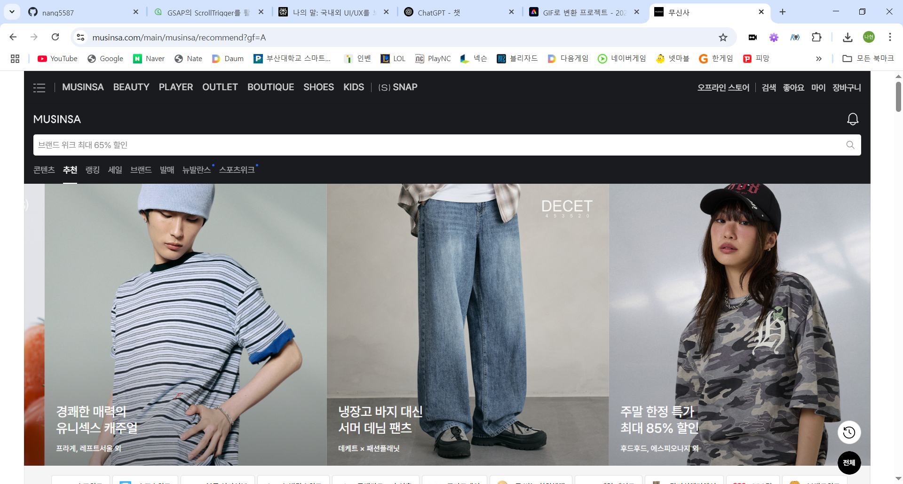
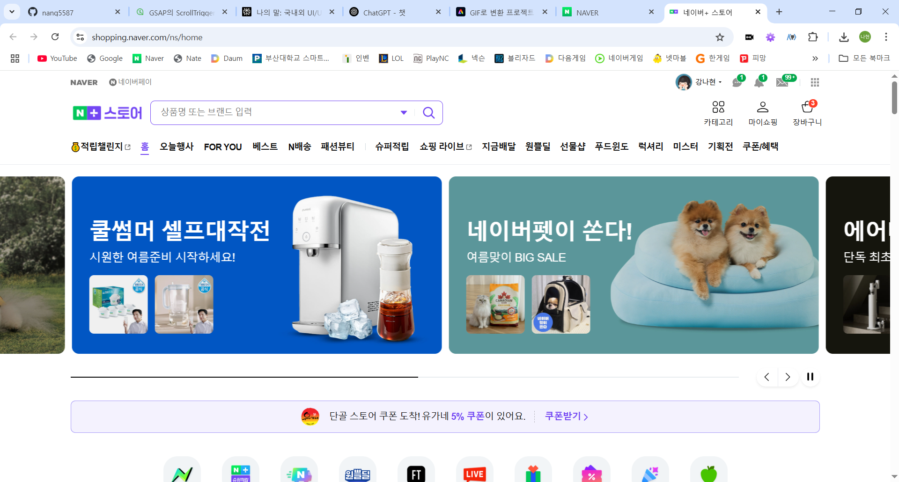
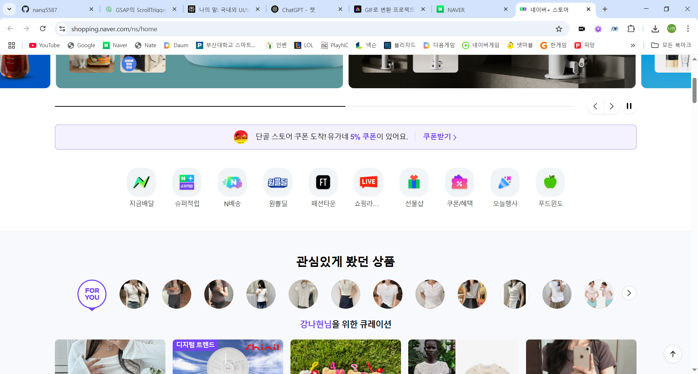
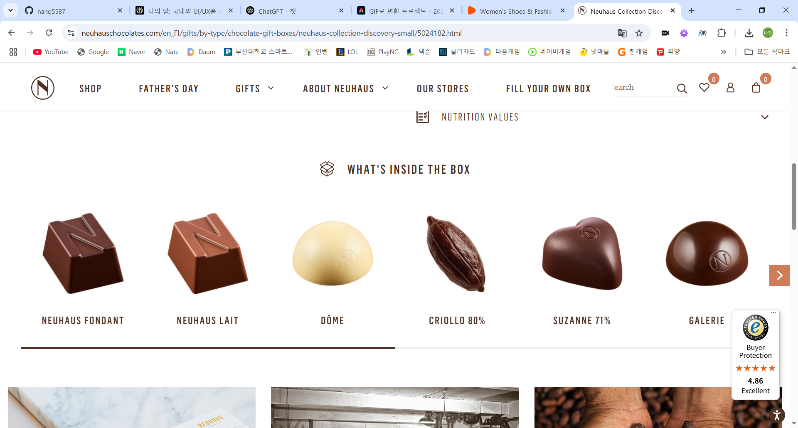
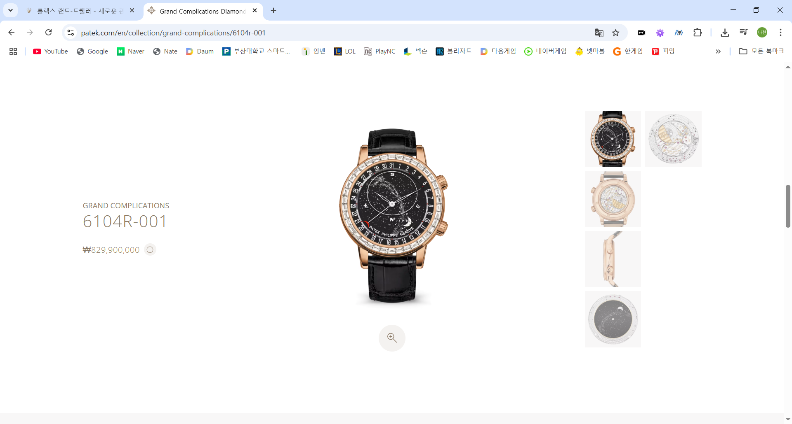

# 📅 2025-06-06 작업 일지

## ✅ 오늘 한 일
- 국내외 이커머스 및 명품 브랜드 사이트 UI/UX 벤치마킹  
  주요 이커머스 및 명품 브랜드 사이트의 상품 상세 페이지, 네비게이션, 장바구니, 검색, 이미지/영상 활용 등 핵심 기능을 직접 분석 및 비교

---

## 📌 주요 사이트별 특징 및 인사이트

### [나이키](https://www.nike.com/)
- 스크롤 내릴 때 네비게이션 바 사라지고, 올릴 때 다시 나타남  
- 로그인 없이 장바구니 사용 가능  
- 장바구니 숫자: 상품 수 기준  
- 상품 디테일컷과 설명을 화면 반반 배치  
- 인기 검색어 노출  
- 상품 상세에 영상 포함
- **좋았던 점**  
  
  - 스크롤을 내리면 네비게이션 바가 없어져서 시야가 트임
  - 스크롤 다시 올리면 네비게이션 바 생김
  
  - 상품 사진 진열 방식이 예쁨

### [무신사](https://www.musinsa.com/)

- 조금 두꺼운 네비게이션 바 
- 장바구니 숫자: 종류 기준  
- 디테일컷 영역이 설명 영역보다 넓음  
- 인기/급상승 검색어(날짜·시간 기준) 제공  

### [지그재그](https://zigzag.kr/)
- 모바일 앱 UI를 웹에 그대로 적용  
- 장바구니 숫자: 종류 기준  
- 일자형 스크롤  
- 실시간 상품 조회수 표시  
- 사진으로 상품 검색  
- 추천 카테고리, 인기/최근 본 상품 등 검색 기능 다양  

### [에이블리](https://m.a-bly.com/)
- 모바일 앱 UI를 웹에 그대로 적용  
- 장바구니 숫자: 종류 기준  
- 일자형 스크롤  
- 사진으로 상품 검색  
- 인기 검색어를 연령대별로 제공(날짜·시간 기준)  

### [네이버스토어](https://shopping.naver.com/ns/home)
- 최근/추천/인기 검색어, 오늘의 혜택 등 검색 기능 다양  
- 장바구니 숫자: 종류 기준  
- 연관 상품 추천 컴포넌트 제공
- **아쉬운 점**
  
  - 정보가 많은 네비게이션 바
  
  - 아이콘 디자인 통일성이 약함

### [아디다스](https://www.adidas.co.kr/)
- 나이키와 비슷한 구조  
- 위로 스크롤 시 네비게이션 바가 늦게 나타남
- 각진 UI  
- 장바구니 담기만 있고 바로 구매 버튼 없음  
- 장바구니 숫자: 상품 수 기준  

### [뉴발란스](https://www.nbkorea.com/)
- 두꺼운 네비게이션 바  
- 최근/추천 검색어 제공  
- 로그인·장바구니 기능 미제공  

### [스파이더](https://spyder.co.kr/)
- 화면 사이즈가 노트북에 최적화되지 않음  
- 실시간 인기 상품 등 검색 기능 다양  
- 장바구니 숫자: 종류 기준  
- 디테일컷이 메인 사진 아래 나열(왼쪽 배치가 더 나을 듯)  

### [Zalando](https://en.zalando.de/women-home/)
- 상품 디테일컷에 마우스 포커스 시 이미지 줌 기능 

### [Neuhaus](https://www.neuhauschocolates.com/en_FI/gifts/by-type/chocolate-gift-boxes/neuhaus-collection-discovery-small/5024182.html)

- 초콜릿 상자 내부 디테일컷 등 고급 이미지 활용

### [Rolex](https://www.rolex.com/ko)

- 애플과 유사한 생동감있는 UI/UX

### [Patek Philippe](https://www.patek.com/en)
- 부드러운 스크롤링
- **좋았던 점**
  
  - 깔끔하고 고급스러움
---

## 📝 주요 인사이트 및 참고사항

- **네비게이션 바**: 스크롤 동작에 따라 노출/숨김, 두께, 정보량 등 사이트별 차이가 큼. 모바일 친화적 구조와 정보 접근성 모두 고려 필요.  
- **장바구니 숫자 표기**: '종류' 기준과 '상품 수' 기준이 혼재. 프로젝트 설계 시 어떤 기준이 더 사용자 친화적인지 논의 필요.  
- **검색 기능**: 인기/추천/급상승/연령대별/최근 검색어 등 다양한 형태로 제공. 검색 경험 강화가 트렌드.  
- **상품 상세 페이지**: 고화질 이미지, 다양한 각도/구성, 영상 활용, 이미지 줌 등 시각적 정보 강화가 중요. 
- **추천/연관 상품**: 장바구니, 상세페이지 등에서 연관 상품 추천 컴포넌트 적극 활용.  
- **명품 브랜드(Neuhaus, Rolex, Patek Philippe 등)**: 고급 이미지, 부드러운 인터랙션, 브랜드 스토리텔링 강화, 디테일컷 중심의 정보 제공이 특징.
