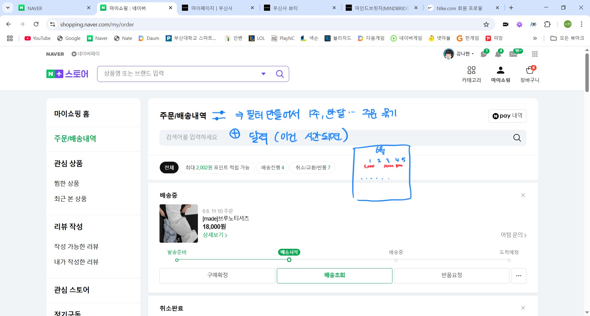

# 📅 2025-06-05 작업 일지

## ✅ 오늘 한 일

- **프로젝트 설계 회의**  
  네이버 스토어의 패션뷰티 웹 사이트의 develope을 위하여 문제점 분석 및 웹 구조 설계

### 📌 주요 내용
- **메인**:  
  
  
  - 카테고리 최대한 줄이고 하나의 아이콘으로 만들어서 모으기
  - 마이쇼핑, 장바구니 줄여서 위로 올리기
  - 히어로 배너는 한 장만 보여주되 밑에 몇 장있는지 작게 띄우기
  - 배너 밑에는 바로 검색 기반 상품 추천 띄우기

- **메인 상품**:
   
   
   - 많은 광고가 동시에 노출되는 방식이지만 상품 사진이 작아서 주목도 떨어짐
   - 무신사처럼 제목 심플하게 하고 상품 사진 크게 하기

- **네비게이션바 선택 시**:
   
   - 불필요한 거 다 없애기
   - 스크롤 내리면 바 사라지고 올리면 나타나게 구현

   
   
   - 나이키처럼 사이드로 빼기

- **디테일**:
   
   
   
   - 디테일컷 사진을 사이드로 옮기기
   - 전반적인 무드 참고

- **장바구니**:
   
   
   - 결제버튼을 사이드로 옮겨서 잘 보이게 함
   - 글자 크기는 현 상태를 최대한 유지하도록 함

- **마이쇼핑**:
   
   - 드롭다운 순서 바꾸기
   - 멤버십 가입을 한 경우에는 메인에서 빼고 사이드바(구독관리)로 옮기기

   
   - 결제일 단위로 상품 묶고 컴포넌트 위에 날짜 크게 표시하기

   
   - 주, 월 등 단위로 묶어서 보여주는 필터 만들기
   - 시간이 된다면 달력으로 어떤 날에 얼마를 썼는지 시각적으로 보이게 만들기

- **결제모듈 & 장바구니**:
  - 기존의 디자인 가져가기
  
---

## 📝 내일 할 일

- 화면설계서 완성
- DB 설계 및 필요한 데이터 정하기